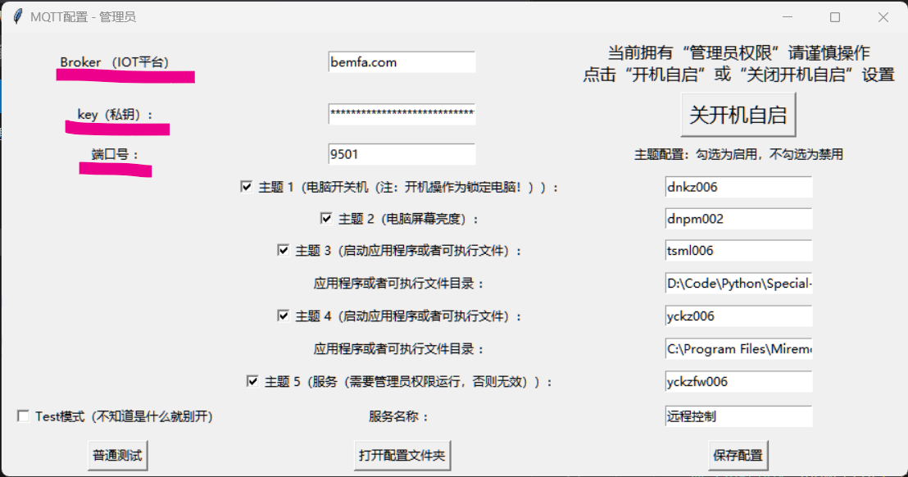
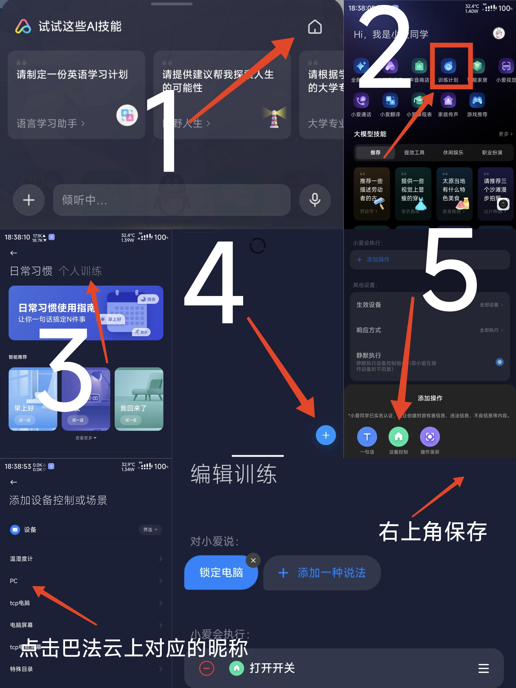

## 注：当前为测试版，之后可能会转tcp协议，不影响使用
#### 免责声明：本程序仅供学习交流使用，不得用于商业用途，如有侵权请联系删除，本人不对使用本程序产生的任何后果负责，请勿用于非法用途，否则后果自负

## 功能
（设备类型开关）小爱远程关机,锁定,启动应用程序或脚本或者服务  
（设备类型灯）调节显示器亮度

## 教程
### 1. 修改MQTT服务器信息
修改你的巴法云订阅和密钥，并创建相应主题（记得修改主题昵称）  具体主题命名规则可以看巴法云接入文档（右上角里面智能音箱部分）[接入文档](https://cloud.bemfa.com/docs/src/speaker_mi.html)  
例如：（记得复制密钥备用）
* 

### 2.启动程序
可以直接下载两个exe文件打开  
也可以下载源码自行编译
打开GUI程序，输入巴法云密钥等信息，点击保存
例：（可分别启用主题（test模式可不启用主题））
* 

### 3.米家绑定巴法云账号
绑定后同步设备，小爱就能控制了
* 
* 