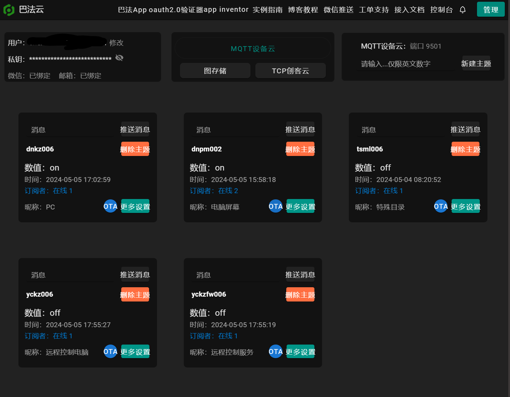
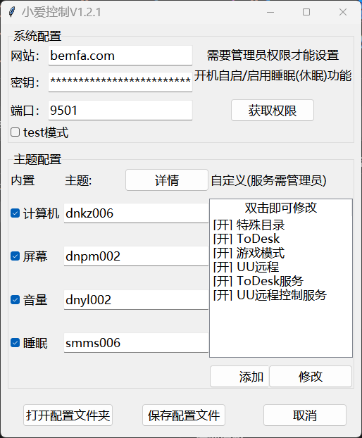

# 远程控制工具（RC-remote-controls）
## 并非传统意义上的远程控制，是将电脑模拟成智能家居，通过mqtt实现远程开关，执行脚本等功能！！
#### 免责声明：本程序仅供学习交流使用，如有侵权请联系删除，本人不对使用本程序产生的任何后果负责，请勿用于非法用途，否则后果自负

## 项目简介

本项目旨在通过小爱同学、天猫精灵等智能音箱，实现对 Windows 电脑的远程控制，包括关机、锁定、启动应用/脚本、服务管理、调节显示器亮度、音量等功能。支持自定义主题，适合有远程自动化需求的用户。

## 功能

- （设备类型开关）远程重启、锁定、启动应用程序或脚本、服务启停
- （设备类型灯）调节显示器亮度
- （设备类型灯）调节系统音量
- 支持自定义主题（程序/脚本/服务）
- 支持开机自启、管理员权限检测
- 支持 test 模式（测试/调试用）

## 环境依赖与安装

### 1. 依赖安装

本项目基于 Python 3.7 及以上，需在 Windows 系统下运行。

依赖安装指令：

```bash
pip install paho-mqtt wmi win11toast pillow pystray comtypes pycaw psutil
pip install --upgrade setuptools
```

如遇 tkinter 相关报错（如 init.tcl 找不到），请参考 main.py 中的注释，将 tcl/tk 文件夹复制到 Python 的 Lib 目录下。

### 2. 打包说明

如需打包为 exe，推荐使用 PyInstaller：

```bash
# 打包GUI程序
pyinstaller -F -n RC-GUI --noconsole --icon=res\icon_GUI.ico GUI.py

# 打包主程序
pyinstaller --onefile -n RC-main --windowed --icon=res\icon.ico --add-data "res\icon.ico;." main.py

# 打包托盘程序
pyinstaller -F -n RC-tray --windowed --icon=res\icon.ico --add-data "res\icon.ico;." tray.py
```

## 教程（参考）

### 1. 修改 MQTT 服务器信息

修改你的巴法云订阅和密钥，并创建相应主题（记得修改主题昵称） 具体主题命名规则可以看巴法云接入文档（右上角里面智能音箱部分）[接入文档](https://cloud.bemfa.com/docs/src/speaker_mi.html)  
例如：（记得复制密钥备用）

- 

### 2. 启动程序

可以直接下载 dist 文件夹下的执行文件，也可以下载源码自行编译：  
- `RC-GUI.exe`：配置界面程序
- `RC-main.exe`：主程序，负责MQTT连接和控制功能
- `RC-tray.exe`：托盘程序，用于管理和监控主程序

打开 GUI 程序，输入巴法云密钥等信息，点击保存。
例：（可分别启用主题（test 模式可不启用主题））

- 

### 3. 米家绑定巴法云账号

绑定后同步设备，小爱就能控制了

- 
- 

## 项目文件说明

本项目由以下主要组件构成：

- `main.py` / `RC-main.exe`：主程序，负责MQTT连接和执行控制命令
- `GUI.py` / `RC-GUI.exe`：配置界面，用于设置MQTT参数和自定义主题
- `tray.py` / `RC-tray.exe`：系统托盘程序，用于监控和管理主程序
- `config.json`：配置文件，存储MQTT连接信息和自定义主题设置

## 托盘程序使用说明

托盘程序(`RC-tray.exe`)提供了便捷的主程序管理功能：

1. **运行方式**：双击`RC-tray.exe`启动，推荐以管理员权限运行
2. **功能菜单**：
   - 显示当前运行模式(EXE/脚本)和权限状态
   - 打开配置界面：快速访问GUI配置工具
   - 检查主程序管理员权限：查看主程序是否具有管理员权限
   - 启动主程序：以管理员权限启动主程序
   - 重启主程序：重新启动主程序(先关闭后启动)
   - 关闭主程序：停止主程序运行
   - 退出托盘程序：关闭托盘但保留主程序运行

3. **自动管理**：托盘程序会自动检测主程序是否运行，如未运行则自动启动

## 常见问题（FAQ）

- Q: 启动报错“应用程序已在运行”？
  A: 程序已启动，勿重复运行。
- Q: 配置文件不存在？
  A: 请先运行 GUI 程序，保存配置。
- Q: 休眠/睡眠不可用？
  A: 请以管理员权限运行 cmd，并尝试执行
```bash
  powercfg /hibernate on
```
- Q: MQTT 无法连接？
  A: 检查服务器地址、端口、密钥是否正确，网络是否畅通。
- Q: 托盘程序无法检测到主程序？
  A: 请尝试以管理员权限运行托盘程序，可能是权限问题导致。
- Q: 脚本无法启动？
  A: 检查脚本路径是否正确，以及是否有运行所需的权限。

## 更新日志

### v2.0.0 (2025-05-12)
- 添加托盘程序功能，方便监控和管理主程序
- 改进管理员权限检测机制
- 优化进程管理和启动流程
- 修复已知问题和稳定性改进

### v1.0.0
- 初始版本发布
- 基本的MQTT远程控制功能
- GUI配置界面
- 自定义主题支持

## 反馈与交流

如有问题、建议或 Bug 反馈，请通过 GitHub Issue 或邮箱（mc_chen6019@qq.com）联系作者。

---
